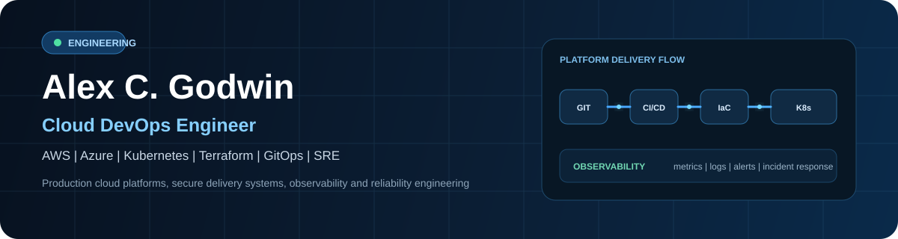
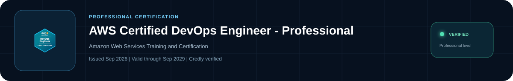
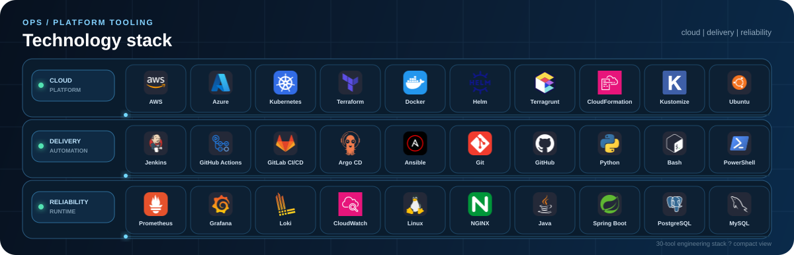
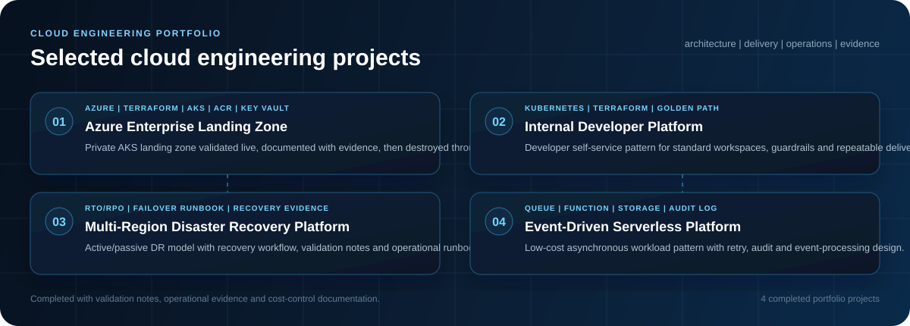
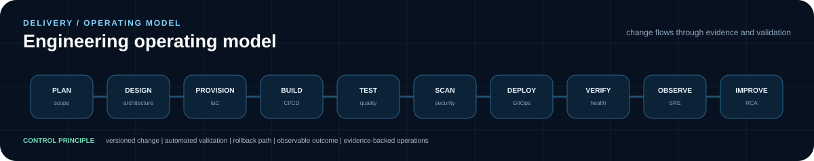

  

  
  
  
  

## Engineering profile

I design, automate and operate cloud platforms with a focus on repeatability, secure delivery and production reliability. My work connects infrastructure architecture, Kubernetes, CI/CD, GitOps, observability, incident response and platform security so teams can ship changes safely and operate systems with clear evidence.

<table>
<tr>
<td width="33%" valign="top">

### Cloud & Platform
AWS and Azure foundations, networking, identity, multi-environment design, EKS/AKS, capacity and production operations.

</td>
<td width="33%" valign="top">

### Delivery Engineering
Terraform, Terragrunt, CloudFormation, Jenkins, GitHub Actions, GitLab CI/CD, Argo CD and rollback-ready delivery.
</td>
<td width="33%" valign="top">

### Reliability & Security
Prometheus, Grafana, Loki, CloudWatch, incident response, RCA, least-privilege IAM, secrets and security controls.

</td>
</tr>
</table>

## Professional certification

  

  <a href="https://www.credly.com/badges/7fcbe698-44e1-4e94-bc7e-c058bfe89229"><b>Verify AWS credential on Credly</b></a>

## Technology stack

  

## Selected engineering work

  

<table>
<tr>
<td width="25%" valign="top"><b><a href="https://github.com/alexcgodwin/azure-enterprise-landing-zone">Azure Enterprise Landing Zone</a></b> Private AKS landing zone validated live, documented with evidence and destroyed through Terraform.</td>
<td width="25%" valign="top"><b><a href="https://github.com/alexcgodwin/internal-developer-platform">Internal Developer Platform</a></b> Golden-path Kubernetes platform pattern with namespace policy, guardrails and repeatable delivery.</td>
<td width="25%" valign="top"><b><a href="https://github.com/alexcgodwin/multi-region-disaster-recovery-platform">Multi-Region DR Platform</a></b> Recovery-oriented architecture with RTO/RPO targets, failover runbook and validation notes.</td>
<td width="25%" valign="top"><b><a href="https://github.com/alexcgodwin/event-driven-serverless-platform">Event-Driven Serverless Platform</a></b> Low-cost asynchronous processing pattern with queue, function, audit log and failure handling.</td>
</tr>
</table>

## Engineering operating model

  

- Infrastructure and delivery changes are version-controlled and reviewable.
- Environments are reproducible from code rather than dependent on manual setup.
- Security controls are built into the delivery path.
- Production deployments include health checks, rollback paths and measurable verification.
- Observability is part of platform design, with operational claims tied to evidence and validation.
## Connect

<table>
<tr>
<td><b>Portfolio</b> <a href="https://alexemekagodwin.com">alexemekagodwin.com</a></td>
<td><b>LinkedIn</b> <a href="https://www.linkedin.com/in/alexcgodwin">linkedin.com/in/alexcgodwin</a></td>
<td><b>Engineering Org</b> <a href="https://github.com/OpsChugex">github.com/OpsChugex</a></td>
<td><b>Email</b> <a href="mailto:alex.godwin@alexemekagodwin.com">alex.godwin@alexemekagodwin.com</a></td>
</tr>
</table>
